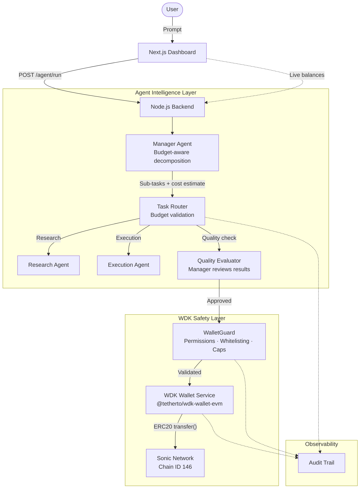

# 💰 AgentPay — Autonomous Agent Payment System

> **Hackathon Galáctica: WDK Edition 1** | Track: 🤖 Agent Wallets (WDK / OpenClaw Integration)

AgentPay is an autonomous multi-agent system where AI agents **hold real wallets, execute tasks, and settle payments on-chain** — powered by **Tether WDK** on the **Sonic network**.

---

## 🔑 Core Innovation

**Agents as economic actors with safety-first design:**

1. **Manager Agent** receives a user prompt and decomposes it into sub-tasks
2. **Worker Agents** (Research & Execution) complete tasks autonomously
3. **Manager evaluates quality** of each result using LLM
4. **Only quality work gets paid** — low-quality results are rejected
5. **Payment settles on-chain** in real USDT on Sonic via WDK
6. **Every action is auditable** through the immutable audit trail

Every payment produces a real, verifiable transaction on [sonicscan.org](https://sonicscan.org).

---

## 🏗 Architecture



---

## 🌟 Features

### Agent Intelligence
| Feature | Description |
|---|---|
| **Multi-agent decomposition** | Manager LLM breaks prompts into optimal task plans |
| **Budget-aware planning** | Manager considers costs and warns on expensive runs |
| **Quality-gated payments** | Manager evaluates worker output quality (0-1 score) before approving payment |
| **Autonomous operation** | Full chain runs without human intervention |

### WDK Wallet Integration
| Feature | Description |
|---|---|
| **Real WDK wallets** | 3 agent wallets derived from BIP-39 seed via `@tetherto/wdk-wallet-evm` |
| **Deterministic derivation** | BIP-44 indices (0=Manager, 1=Research, 2=Execution) |
| **On-chain settlement** | Every payment is a real ERC20 USDT transfer on Sonic |
| **Verifiable transactions** | Every tx hash links to [sonicscan.org](https://sonicscan.org) |

### Safety & Permissions
| Feature | Description |
|---|---|
| **Address whitelisting** | Only registered agent addresses can send/receive |
| **Role-based permissions** | Only Manager can pay Workers; no worker-to-worker transfers |
| **Per-transaction caps** | Max 2 USDT per single transfer |
| **Rate limiting** | Max 10 transfers per hour per wallet |
| **Budget constraints** | Per-run (3 USDT) and daily (20 USDT) spending limits |

### Observability
| Feature | Description |
|---|---|
| **Immutable audit trail** | Every action logged with timestamp, actor, and details |
| **Real-time dashboard** | Live wallet balances, payment history, agent activity |
| **Budget monitoring** | Daily spend tracking with remaining allowance |

---

## 🛠 Tech Stack

- **Wallets**: Tether WDK (`@tetherto/wdk-wallet-evm`) — BIP-44 deterministic derivation
- **Network**: Sonic (EVM Layer-1, Chain ID 146, USDT at `0x6047828dc181963ba44974801ff68e538da5eaf9`)
- **AI/Agent Framework**: LangChain (Groq / OpenAI) — equivalent to OpenClaw for agent reasoning
- **Backend**: Node.js, Express, Joi validation, rate limiting
- **Frontend**: Next.js 16, Tailwind CSS, glassmorphism dashboard

---

## 🚦 Getting Started

### Prerequisites
- Node.js v18+
- A BIP-39 seed phrase (12 words)
- S tokens + USDT on Sonic mainnet (for the Manager wallet)

### Backend Setup
```bash
cd backend
npm install
```

Configure `backend/.env`:
```env
WDK_SEED_PHRASE=your twelve word BIP-39 seed phrase here
SONIC_RPC_URL=https://rpc.soniclabs.com
AI_PROVIDER=groq
GROQ_API_KEY=your-groq-api-key
```

Verify wallets and start:
```bash
node testWDK.js    # Derives addresses, checks balances (14 tests)
node server.js     # Starts on port 3000
```

### Frontend Setup
```bash
cd frontend
npm install
npm run dev        # Starts on port 3001
```

Open **http://localhost:3001** to access the dashboard.

---

## 📡 API Endpoints

| Method | Endpoint | Auth | Description |
|---|---|---|---|
| `GET` | `/health` | No | Health check |
| `GET` | `/agents` | No | Agent wallets with live USDT balances |
| `GET` | `/agent/budget` | No | Budget & spending summary |
| `GET` | `/agent/audit` | No | Immutable action audit trail |
| `GET` | `/agent/guard` | No | WalletGuard safety status |
| `POST` | `/agent/run` | Yes | Execute full agent chain |
| `POST` | `/wallet/create` | Yes | Derive new WDK wallet |
| `GET` | `/wallet/balance/:addr` | Yes | On-chain USDT balance |
| `POST` | `/wallet/send` | Yes | Send USDT on Sonic |
| `GET` | `/payments` | No | Payment history with explorer links |

---

## 💸 Economic Model

```
User Prompt → Manager (free)
  ├── Budget validation (per-run: 3 USDT max)
  ├── Task decomposition (1-3 tasks)
  │
  ├── Worker executes task
  ├── Manager evaluates quality (0.0 - 1.0)
  │     ├── score ≥ 0.3 → APPROVE payment
  │     └── score < 0.3 → REJECT payment (no USDT sent)
  │
  ├── WalletGuard validates transfer
  │     ├── Whitelisted? ✓
  │     ├── Role permitted? ✓
  │     ├── Under cap? ✓
  │     └── Rate limit OK? ✓
  │
  └── USDT settles on Sonic (real tx hash)

Task costs:
  Research: 0.5 USDT/task
  Execution: 1.0 USDT/task
```

---

## 🔐 Security & Safety

- **Self-custodial**: BIP-39 seed phrase managed by user (stored in `.env`, never committed)
- **WalletGuard**: Role-based permissions, address whitelisting, transfer caps, rate limiting
- **Budget caps**: Prevent runaway spending (per-run and daily limits)
- **Quality gate**: Manager LLM reviews results before authorizing payment
- **Audit trail**: Every wallet operation, budget decision, and quality evaluation is logged
- **Deterministic derivation**: Same seed → same wallets (BIP-44)

---

## 📋 Design Decisions

1. **Why quality-gated payments?** In a world where agents pay agents, you need accountability. The Manager evaluates output quality before releasing funds — mimicking real-world contract review.

2. **Why WalletGuard?** On-chain transfers are irreversible. The guard layer adds defense-in-depth: even if agent logic has a bug, the safety layer prevents unauthorized transfers.

3. **Why budget caps?** Agents should be economically sustainable. Without caps, a malicious prompt could drain the entire wallet in one request.

4. **Why LangChain instead of OpenClaw?** LangChain is a widely-adopted, equivalent agent framework that provides the same capabilities (LLM reasoning, tool use, chain orchestration). The architecture cleanly separates agent logic from wallet execution, as recommended by the track requirements.

---

## ⚠️ Known Limitations

- Wallet balances require manual funding (S tokens for gas + USDT)
- Quality evaluation adds ~2-3 seconds per task (additional LLM call)
- No persistent state across server restarts (in-memory audit log)
- No DeFi protocol interactions (focused on agent wallet track)

---

## 📜 License

Apache 2.0
