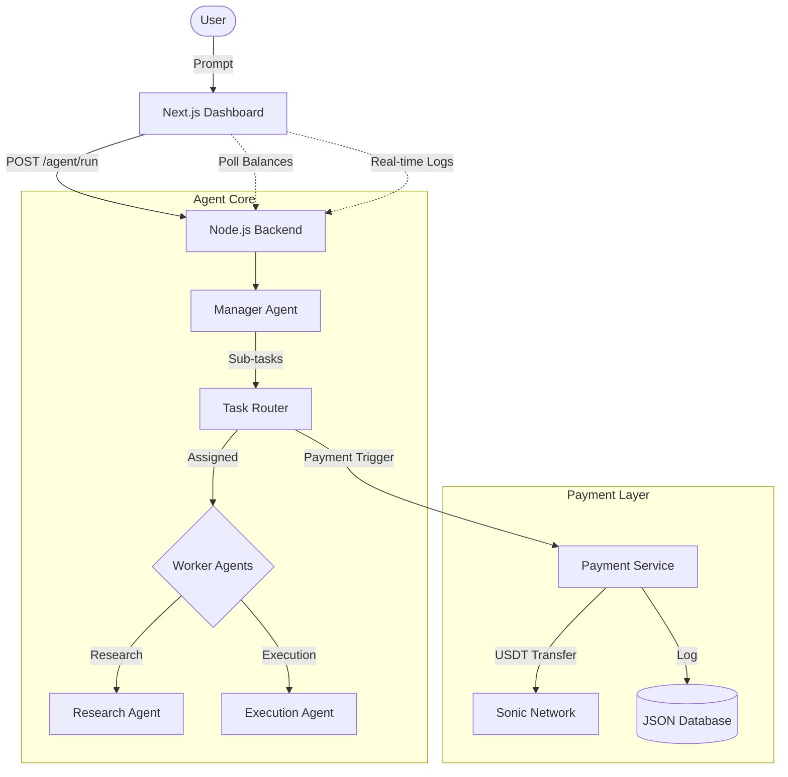

# AgentPay: Autonomous Agent Payment System

AgentPay is a multi-agent system built on the Sonic network that automates task decomposition, execution, and real-time payment settlement between AI agents.

## 🚀 Key Features
- **Manager Agent**: Decomposes complex user prompts into executable sub-tasks.
- **Worker Agents**: Research and Execution agents that handle specialized tasks.
- **Sonic Payment Layer**: Automatic USDT settlement for every completed task via the Sonic network.
- **Cyberpunk Dashboard**: Real-time observability of agent reasoning, task logs, and wallet balances.

## 🏗 Architecture

## 🛠 Tech Stack
- **Frontend**: Next.js 16, Tailwind CSS, Lucide Icons, Shadcn-like glassmorphism.
- **Backend**: Node.js, Express, Joi validation.
- **AI**: Google Gemini / Groq (Manager & Workers).
- **Network**: Sonic (USDT Settlements).

## 🚦 Getting Started

### Prerequisites
- Node.js v18+
- Sonic Network Wallet (Manager & Agent wallets)

### Backend Setup
1. `cd backend`
2. `npm install`
3. Configure `.env` with AI API keys and Wallet Private Keys.
4. `node server.js` (Runs on port 3000)

### Frontend Setup
1. `cd frontend`
2. `npm install`
3. `npm run dev` (Runs on port 3001)
4. Open `http://localhost:3001/dashboard`

## 📊 Dashboard Sections
1. **Run Agent**: Command center for user prompts.
2. **Wallet Balances**: Live tracking of Agent USDT balances.
3. **Agent Activity**: Real-time trace of Manager reasoning and Worker logs.
4. **Payment History**: Verifiable transaction log with Sonic explorer links.
